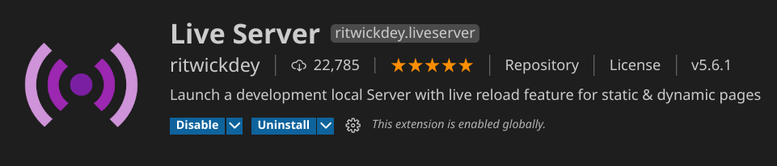
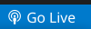

To test this page you can do the following:

- Download VSCode editor.
- Install the "Live Server" extension

- Run the live server on this repo by clicking the "Go Live" button at the bottom right of VSCode

